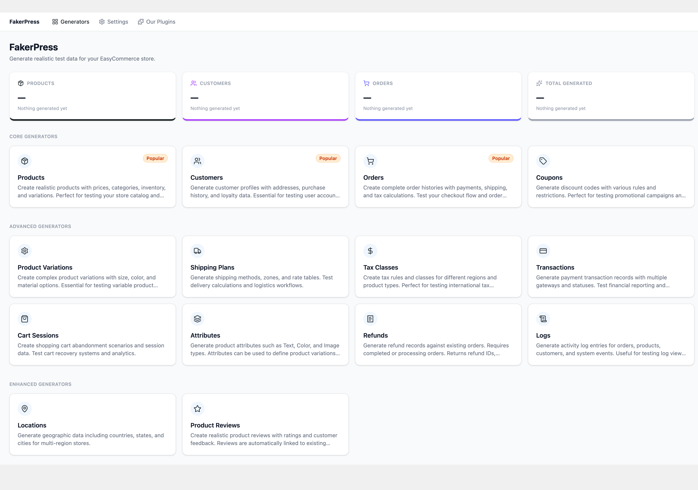
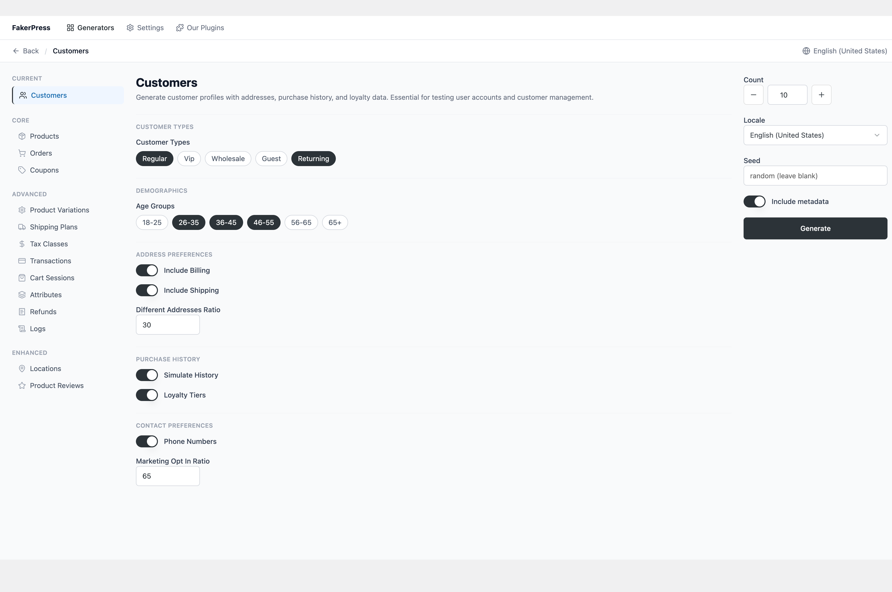
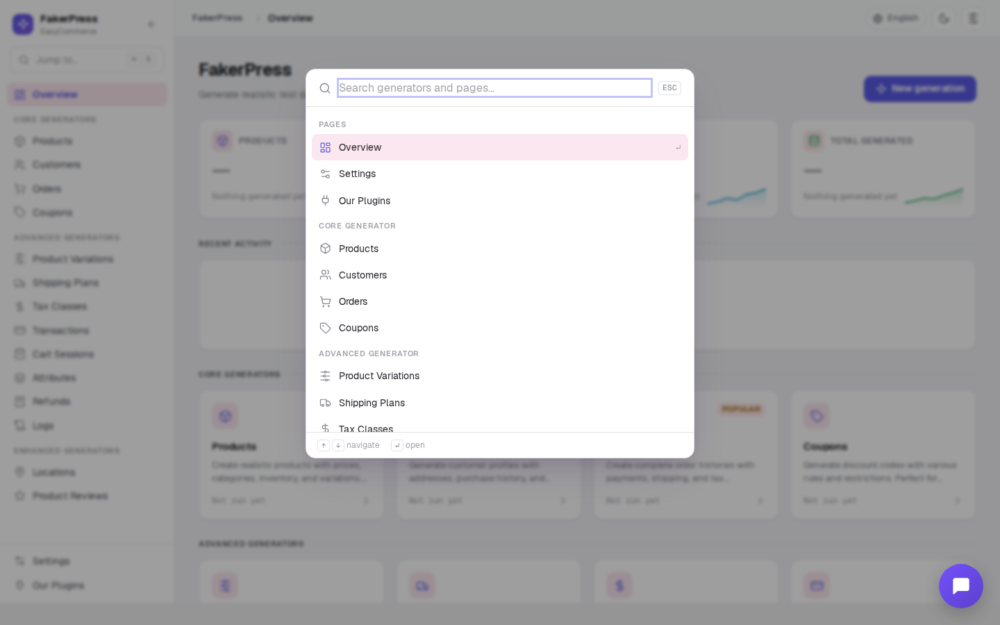

# EasyCommerce FakerPress

[](https://wordpress.org/)
[](http://www.gnu.org/licenses/gpl-2.0.txt)
[](https://php.net/)
[]()

A comprehensive WordPress plugin that generates realistic fake ecommerce data for EasyCommerce stores. Features 10 specialized generators, advanced parameter configuration, WordPress admin color integration, and modern React interface with comprehensive business logic modeling.

## 🚀 Quick Start

1. **Install Dependencies**: `composer install && npm install`
2. **Build Assets**: `npm run build`
3. **Activate Plugin**: WordPress Admin → Plugins → Activate "EasyCommerce FakerPress"
4. **Access Interface**: WordPress Admin → EC FakerPress

For detailed installation instructions, see our [Installation Guide](docs/installation.md).

## ✨ Key Features

- 🗂️ **10 Specialized Generators** - Products, Customers, Orders, Coupons, and more
- 🎛️ **Advanced Parameter System** - Dynamic configuration with smart defaults
- 🎨 **Modern Interface** - React 18 with WordPress admin color integration
- 🏗️ **Enterprise Architecture** - PSR-4, REST API, EasyCommerce integration

See the complete [Features Overview](docs/features.md) for detailed information.

## 📸 Screenshots

### Main Interface

*The modern, tabbed interface with WordPress admin color integration*

### Product Generator

*Advanced product generation with attributes, variations, and inventory settings*

### Customer Generator

*Comprehensive customer profile generation with demographics and loyalty tiers*

### Order Generator

*Complete order generation with payment processing and shipping calculations*

## 📚 Documentation

| Document | Description |
|----------|-------------|
| [Installation Guide](docs/installation.md) | Setup instructions and requirements |
| [Usage Guide](docs/usage.md) | How to use the generators and interface |
| [Features Overview](docs/features.md) | Complete feature list and capabilities |
| [Architecture](docs/architecture.md) | Technical architecture and design patterns |
| [Development Guide](docs/development.md) | Contributing and development workflow |
| [Changelog](docs/changelog.md) | Version history and release notes |

## 📋 Requirements

- **WordPress**: 5.0 or higher
- **PHP**: 7.4 or higher
- **EasyCommerce Plugin**: Required for ecommerce functionality
- **Node.js**: 14+ (for development)
- **Composer**: For PHP dependency management

## 🛠️ Quick Commands

```bash
# Install dependencies
composer install && npm install

# Development
npm run dev              # Watch mode for development
npm run build            # Production build

# Code quality
npm run lint             # Lint JS and CSS
composer run lint        # PHP CodeSniffer
```

See the [Development Guide](docs/development.md) for complete build instructions.

## 🏗️ Technology Stack

- **Backend**: PHP 7.4+, WordPress REST API, EasyCommerce Models
- **Frontend**: React 18, React Router v7, Tailwind CSS, Headless UI
- **Build Tools**: Webpack 5, Babel, PostCSS, Sass
- **Data Generation**: Faker PHP library with realistic patterns
- **Code Quality**: ESLint, Stylelint, PHPCS, PHPStan level 8

## 🤝 Contributing

Contributions are welcome! Please read our [Development Guide](docs/development.md) for:

- Development workflow and setup
- Coding standards and quality tools
- Pull request process
- Testing guidelines

## 📝 License

This project is licensed under the GPL v2 or later - see the [LICENSE](LICENSE) file for details.

## 👨‍💻 Author

**Al Amin Ahamed**
- Website: [alaminahamed.com](https://github.com/mralaminahamed/)
- GitHub: [@mralaminahamed](https://github.com/mralaminahamed)
- Email: me@alaminahamed.com

## 🆘 Support

For support and bug reports, please use the [GitHub Issues](https://github.com/mralaminahamed/easycommerce-fakerpress/issues) page.

---

**Current Version**: v1.0.0 | **Last Updated**: September 23, 2025

For detailed release information, see the [Changelog](docs/changelog.md).

#### 🎨 Modern User Experience:
- **WordPress Admin Color Integration**: Automatic adaptation to user's chosen admin color scheme
- **Advanced Parameter System**: Dynamic, nested parameters with intelligent validation and smart defaults
- **Enhanced Form Controls**: Modern React interface with smart form fields and proper labeling
- **Tabbed Navigation**: Organized 10-generator interface with progress tracking
- **Real-time Feedback**: Live generation progress with detailed status updates and error handling
- **Responsive Design**: Mobile-optimized interface with improved accessibility

#### 🏗️ Enterprise Architecture:
- **PSR-4 Architecture**: Modern PHP with namespacing, autoloading, and abstract base classes
- **REST API Controllers**: 10 clean API controllers with comprehensive parameter schemas
- **EasyCommerce Integration**: Native model usage with Order_Item_Meta and location system integration
- **WordPress Standards**: Full WPCS compliance with security best practices and proper internationalization
- **Extensible Design**: Hook system and abstract patterns for easy customization and extension

#### 🔧 Technical Excellence:
- **Modern Build System**: React 18, Tailwind CSS, Webpack 5 with CSS variable integration
- **Advanced Validation**: Client-side and server-side parameter validation with proper error handling
- **State Management**: Complex form handling with nested object parameter support
- **Performance Optimization**: Efficient database operations and memory management
- **Developer Experience**: Comprehensive documentation, modern tooling, and extensive customization hooks
