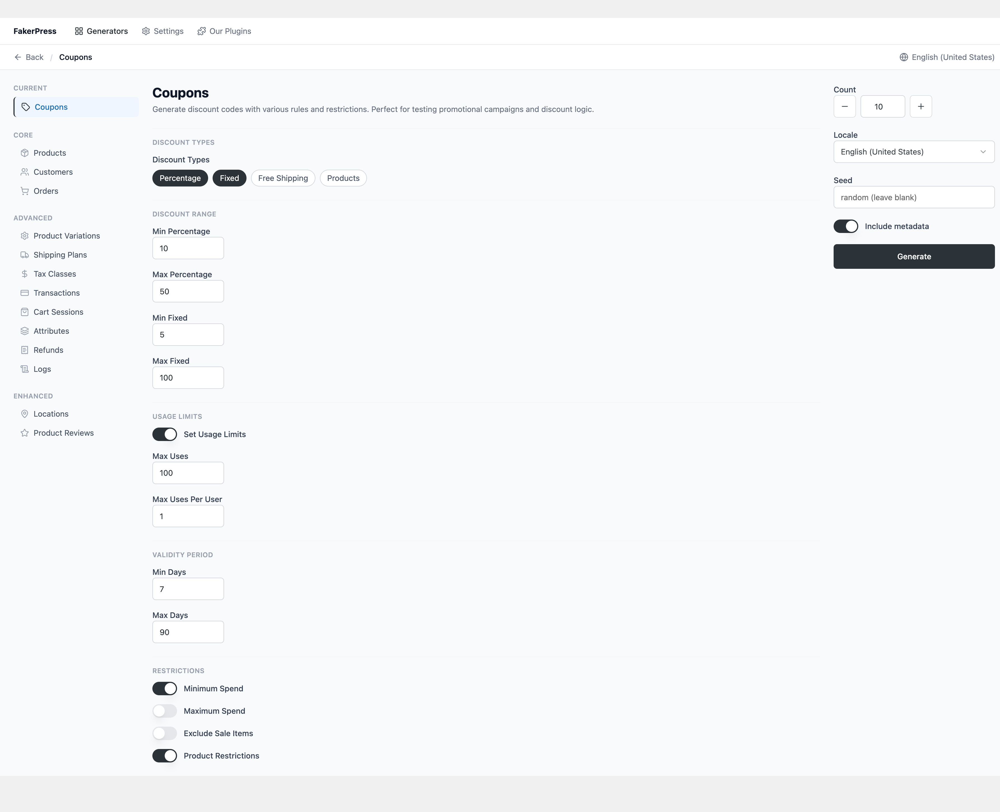
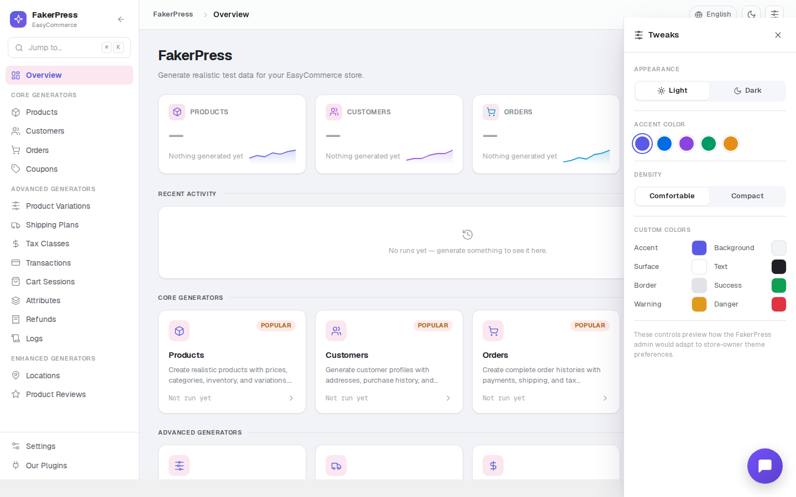
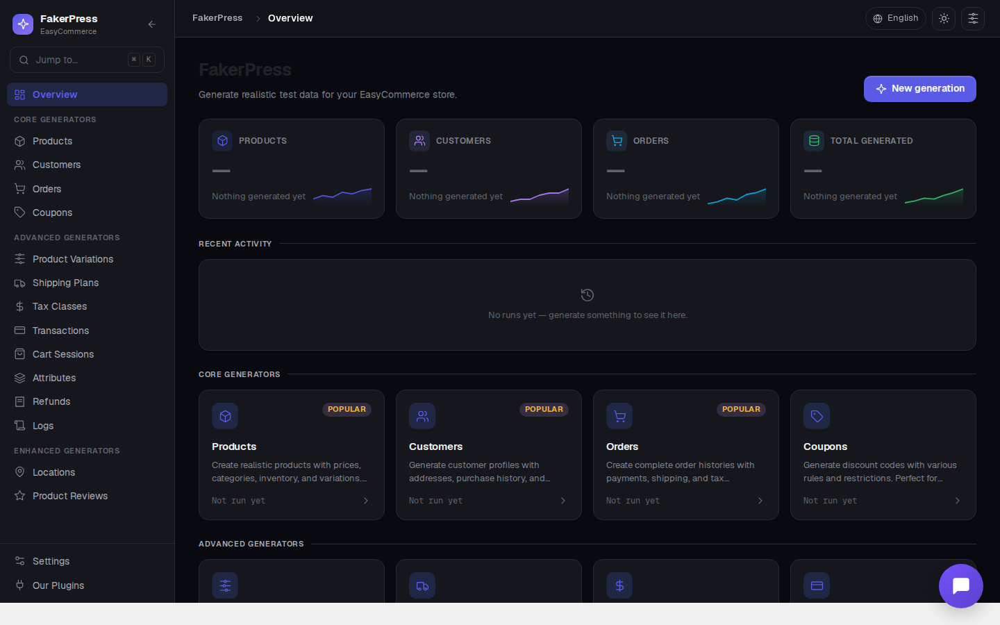
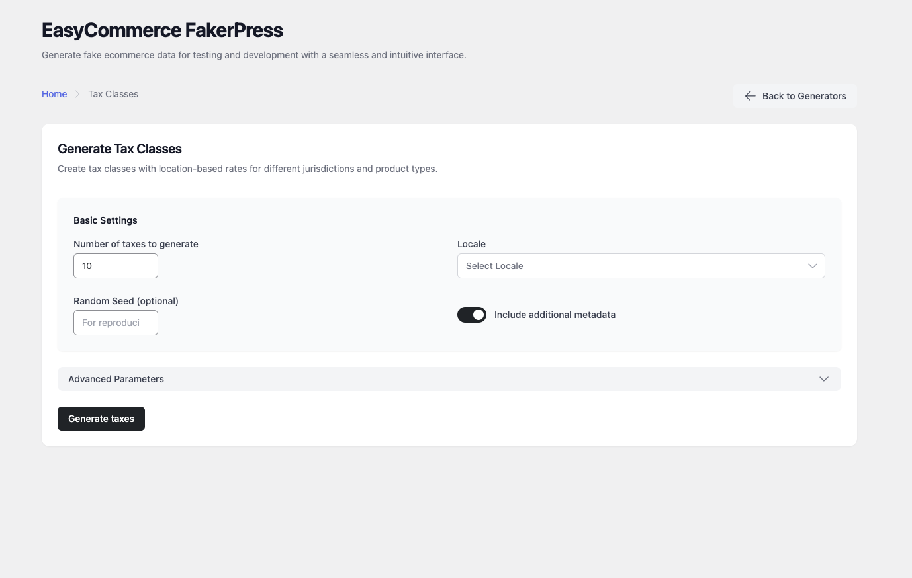
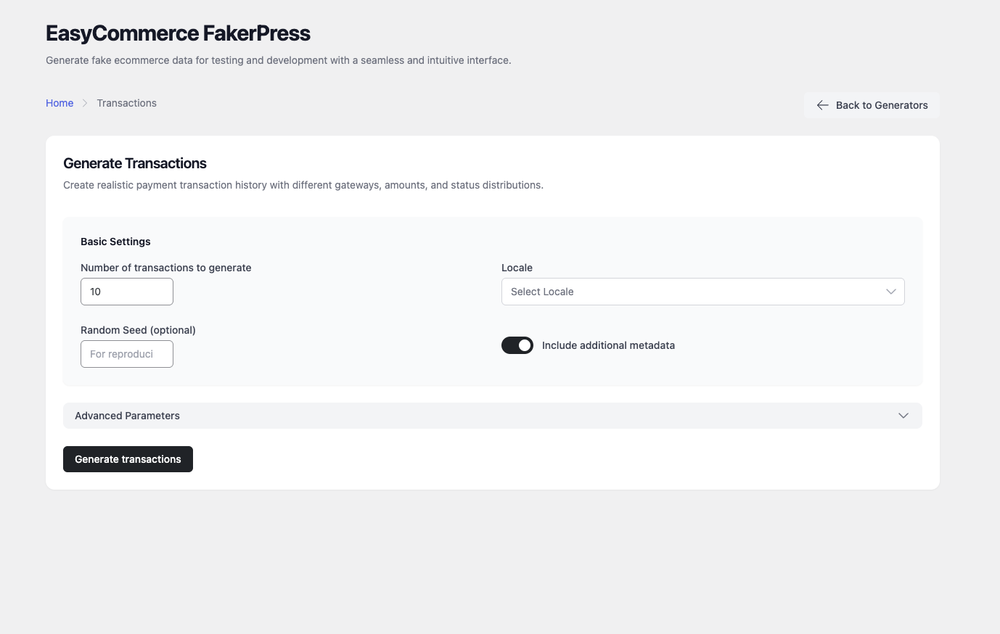
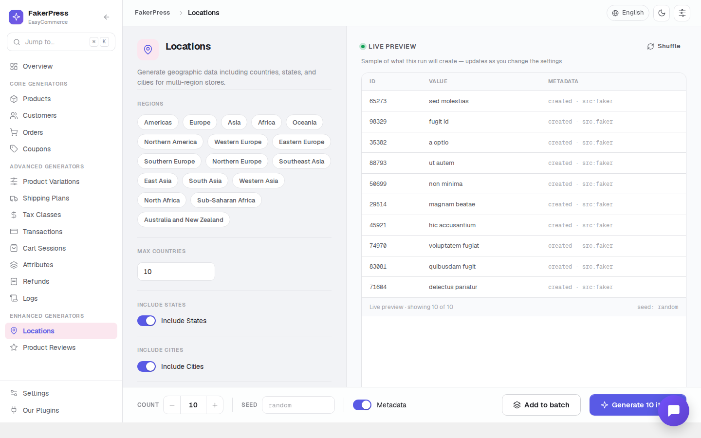

# EasyCommerce FakerPress

[](https://wordpress.org/plugins/easycommerce-fakerpress/)
[](http://www.gnu.org/licenses/gpl-2.0.txt)
[](https://php.net/)
[]()

Generate realistic test data for your EasyCommerce store. 14 specialized generators, modern admin UI, run history, configurable settings, and sample data sync from GitHub.

---

## What It Does

EasyCommerce FakerPress populates your EasyCommerce store with realistic fake data for development, testing, and demos. Choose a generator, configure the parameters, and click Generate.

**Use cases:**
- Developing new features that need existing store data
- Testing plugins, themes, and integrations against realistic datasets
- Creating client demos with populated product catalogs and orders
- Performance testing with large datasets

---

## Generators

### Core
| Generator | Description |
|-----------|-------------|
| Products | Products with pricing, categories, inventory, and variations |
| Customers | Customer profiles with addresses, demographics, and purchase history |
| Orders | Complete order histories with payments, shipping, and tax |
| Coupons | Discount codes with rules, usage limits, and restrictions |

### Advanced
| Generator | Description |
|-----------|-------------|
| Product Variations | Variable product attributes, price variance, and stock settings |
| Shipping Plans | Shipping methods, zones, and rate tables |
| Tax Classes | Tax rules and classes for different regions and product types |
| Transactions | Payment transaction records with multiple gateways and statuses |
| Cart Sessions | Shopping cart abandonment scenarios and session data |
| Attributes | Product attribute types (Text, Color, Image) for variations |
| Refunds | Refund records against existing completed or processing orders |
| Logs | Activity log entries for orders, products, customers, and system events |

### Enhanced
| Generator | Description |
|-----------|-------------|
| Locations | Geographic data including countries, states, and cities |
| Product Reviews | Product reviews with ratings linked to existing products and customers |

---

## Features

- **Run History** — Per-generator run log stored in browser localStorage; recent runs shown in sidebar; all-time stats on the dashboard
- **Settings** — Default count, locale, seed, and metadata preference; configurable max run history; sample data sync from GitHub
- **Sample Data Sync** — One-click download of locale-specific reference data (75+ locales) from the companion repository
- **Our Plugins Page** — Browse the author's other WordPress.org plugins with live data
- **Hook System** — 15+ filters and actions for complete data customization
- **REST API** — 14 REST controllers under `easycommerce-fakerpress/v1`
- **Playwright E2E Suite** — 131 automated tests covering all generators, field types, and UI interactions

---

## Requirements

- WordPress 5.0+
- PHP 7.4+ (8.0+ recommended)
- EasyCommerce plugin (required, must be active)
- Composer (for PHP dependencies)
- Node.js 20+ (development only)

---

## Installation

### From WordPress.org

1. Go to **Plugins > Add New** in your WordPress admin
2. Search for "EasyCommerce FakerPress"
3. Click **Install Now**, then **Activate**
4. Access via **EC FakerPress** in the admin menu

### Manual

1. Download the plugin ZIP
2. Upload to `/wp-content/plugins/easycommerce-fakerpress/`
3. Run `composer install` in the plugin directory
4. Activate via the Plugins screen

### Development

```bash
git clone https://github.com/mralaminahamed/easycommerce-fakerpress.git
cd easycommerce-fakerpress
composer install
yarn install
yarn build
```

---

## Commands

```bash
# Development
yarn start                   # Webpack watch mode
yarn build                   # Production build

# PHP
composer test                # PHPUnit
composer phpcs               # WordPress coding standards lint
composer phpcbf              # Auto-fix coding standards
composer phpstan             # Static analysis (level 8)
composer release             # Lint + analyse + build + makepot + zip

# E2E tests
yarn test:e2e:setup          # Configure WP test environment
yarn test:e2e                # Run all 131 Playwright tests
yarn test:e2e:ui             # Playwright interactive UI
yarn test:e2e:report         # Open HTML test report
```

---

## Architecture

### PHP

```
easycommerce-fakerpress.php          Plugin bootstrap
class-easycommerce-fakerpress.php    Singleton orchestrator
includes/
  Abstracts/Generator.php            Base generator (FakerPHP, batch, logging)
  Abstracts/Controller.php           Base REST controller (WP_REST_Controller)
  Generators/                        14 concrete generators
  Controllers/                       14 REST controllers
  MCP/                               MCP server + abilities
```

### REST API

```
POST /easycommerce-fakerpress/v1/{resource}/generate
```

Params validated via JSON Schema in each controller's `get_params()`. Returns `{ id, message, metadata }`.

### JS

Built with React 18, React Router v7, Radix UI, and Tailwind CSS v4. Entry point: `src/index.tsx`. Output: `build/app.js`.

---

## Extensibility

```php
// Modify generated data before creation
add_filter( 'easycommerce_fakerpress_product_data_before_create', function( $data ) {
    $data['status'] = 'draft';
    return $data;
} );

// Hook after item created
add_action( 'easycommerce_fakerpress_after_product_created', function( $product_id, $data ) {
    // custom logic
}, 10, 2 );

// Filter REST response
add_filter( 'easycommerce_fakerpress_rest_response', function( $response, $request ) {
    return $response;
}, 10, 2 );
```

---

## Screenshots

### Dashboard


Stats bar with live generation counts and generator grid grouped by category (Core, Advanced, Enhanced).

### Products Generator


Two-panel layout: sidebar with category nav and run history, params panel, sticky action panel.

### Customers Generator


Customer type and age group chip selects, address preference toggles, purchase history options.

### Orders Generator


Order status selector, customer distribution controls, items-per-order range, payment methods.

### Coupons Generator


Discount type chips, discount range inputs, usage limits, validity period, and restrictions.

### Product Variations Generator


Product type selection, price variance range, stock management, variation attribute settings.

### Transactions Generator


Transaction types, payment gateways, amount range, and status distribution controls.

### Settings Page


Default count, locale, seed, metadata toggle; run history limit; sample data sync; About card; Danger Zone.

### Our Plugins Page


Live WordPress.org plugin cards with ratings, active install counts, and direct links.

### Product Reviews Generator


Target specific products by ID, count, locale, seed, and metadata options.

### Locations Generator


Region chip selects, max countries, states, cities per state, and coordinate generation.

---

## Security

- All REST endpoints require `manage_options` capability
- Parameters validated via JSON Schema before processing
- Generated data is fictional — for non-production use only
- No external data transmission; all data stays in your WordPress database

---

## Contributing

1. Fork the repository
2. Create a feature branch
3. Follow WordPress Coding Standards and PSR-4
4. Add tests for new generators (PHPUnit + Playwright)
5. Submit a pull request

Report bugs and request features via [GitHub Issues](https://github.com/mralaminahamed/easycommerce-fakerpress/issues).

---

## License

GPL v2 or later. See [LICENSE](LICENSE).

## Author

Al Amin Ahamed — [alaminahamed.com](https://alaminahamed.com) — [@mralaminahamed](https://github.com/mralaminahamed)
