<div align="center">

# EasyCommerce FakerPress

[](https://wordpress.org/plugins/easycommerce-fakerpress/)
[](https://wordpress.org/plugins/easycommerce-fakerpress/)
[](https://wordpress.org/plugins/easycommerce-fakerpress/)
[](https://wordpress.org/plugins/easycommerce-fakerpress/advanced/)
[](LICENSE)

Generate realistic test data for EasyCommerce stores — 14 generators, live preview, batch queue, and a modern admin UI.

</div>

> [!WARNING]
> This plugin writes large volumes of fake data directly into your store. Use it only on development or staging sites, and back up your database before generating large datasets.

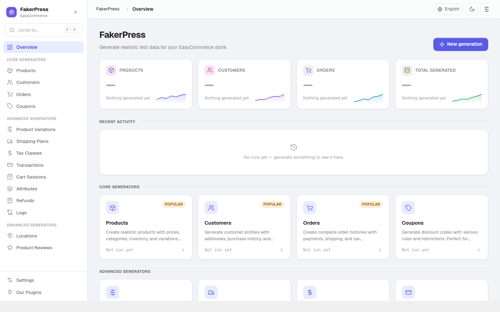

## Quick Start

Install from the WordPress admin — **Plugins → Add New**, search for "EasyCommerce FakerPress", then **Install Now** and **Activate**. The plugin appears as **EC FakerPress** in the admin menu.

To run it from source instead:

```bash
git clone https://github.com/mralaminahamed/easycommerce-fakerpress.git
cd easycommerce-fakerpress
composer install
yarn install
yarn build
```

Requires [EasyCommerce](https://wordpress.org/plugins/easycommerce/), declared as a hard dependency via the `Requires Plugins` header — WordPress blocks activation until EasyCommerce is installed and active. Minimum WordPress, PHP, and tested-up-to versions are shown in the badges above; `readme.txt` and the plugin header are the source of truth. Node.js 20+ is needed for development only.

## What It Does

EasyCommerce FakerPress populates your EasyCommerce store with realistic fake data for development, testing, and demos. Choose a generator, configure the parameters, and click Generate.

- Developing features that need existing store data
- Testing plugins, themes, and integrations against realistic datasets
- Building client demos with populated catalogs and order histories
- Performance testing with large datasets

## Generators

Fourteen generators, grouped by category in the admin.

| Generator | Category | Description |
|-----------|----------|-------------|
| Products | Core | Products with pricing, categories, inventory, and variations |
| Customers | Core | Customer profiles with addresses, demographics, and purchase history |
| Orders | Core | Complete order histories with payments, shipping, and tax |
| Coupons | Core | Discount codes with rules, usage limits, and restrictions |
| Product Variations | Advanced | Variable product attributes, price variance, and stock settings |
| Shipping Plans | Advanced | Shipping methods, zones, and rate tables |
| Tax Classes | Advanced | Tax rules and classes for different regions and product types |
| Transactions | Advanced | Payment transaction records with multiple gateways and statuses |
| Cart Sessions | Advanced | Shopping cart abandonment scenarios and session data |
| Attributes | Advanced | Product attribute types (Text, Color, Image) for variations |
| Refunds | Advanced | Refund records against existing completed or processing orders |
| Logs | Advanced | Activity log entries for orders, products, customers, and system events |
| Locations | Enhanced | Geographic data including countries, states, and cities |
| Product Reviews | Enhanced | Product reviews with ratings linked to existing products and customers |

## Features

| Feature | Description |
|---------|-------------|
| Design-token UI | Light/dark themes, 5 accent palettes, comfortable/compact density — all scoped to the plugin so WordPress chrome is never restyled |
| Live preview | A read-only REST preview route returns real faker rows without persisting anything; the table refreshes as you change settings and re-rolls on Shuffle |
| Command palette | <kbd>Cmd</kbd>/<kbd>Ctrl</kbd>+<kbd>K</kbd> to quick-jump to any generator or page |
| Batch queue | Queue multiple generators and run them sequentially from the batch tray, with live progress |
| Run history | Per-generator run log in browser localStorage; recent runs in the sidebar, all-time stats on the dashboard |
| Settings | Default count, locale, seed, metadata preference, run-history limit, and sample data sync |
| Sample data sync | One-click download of locale-specific reference data (75+ locales) from the companion repository |
| Hook system | 15+ filters and actions for data customization |
| REST API | 14 controllers under `easycommerce-fakerpress/v1` |
| E2E suite | 131 Playwright tests covering all generators, field types, and UI interactions |

## Screenshots

<details>
<summary>View all 11 screenshots</summary>

### Generator page

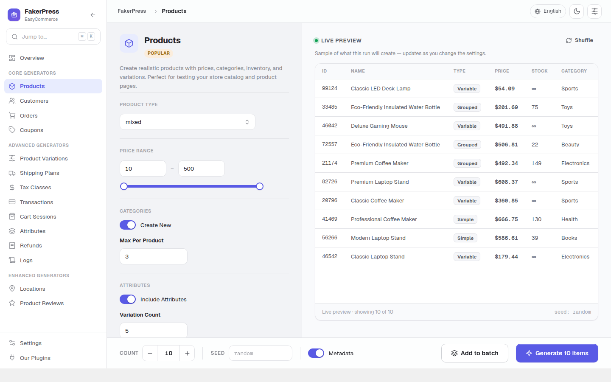

Two-column layout with schema-driven config controls on the left and a live preview table on the right, plus a sticky run bar.

### Live preview

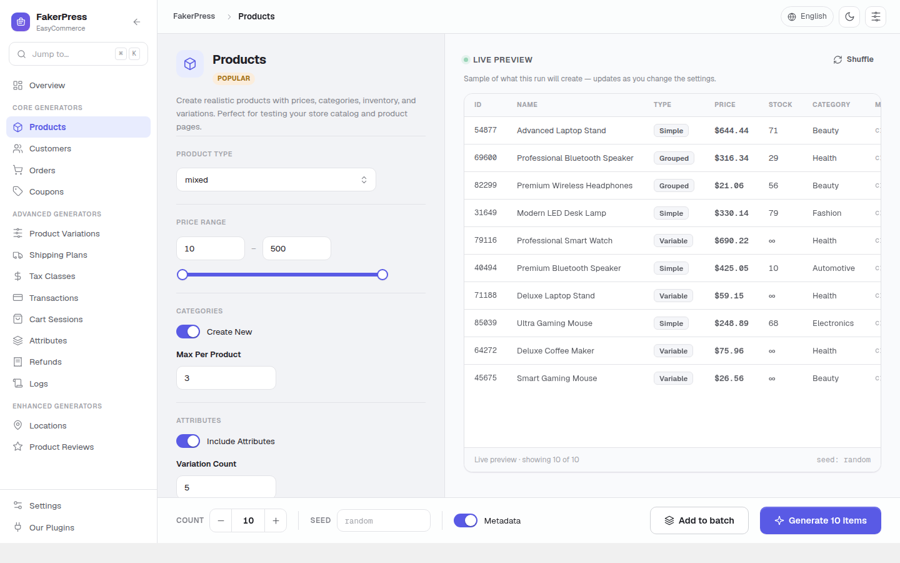

Real faker sample rows that refresh as you change settings, with a Shuffle button to re-roll the seed. No data is persisted.

### Command palette

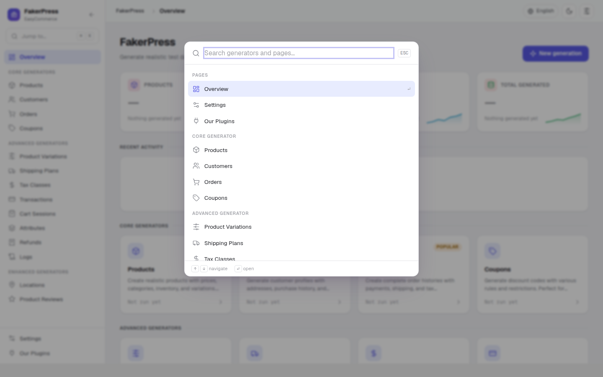

Press <kbd>Cmd</kbd>/<kbd>Ctrl</kbd>+<kbd>K</kbd> to quick-jump to any generator or page.

### Batch queue

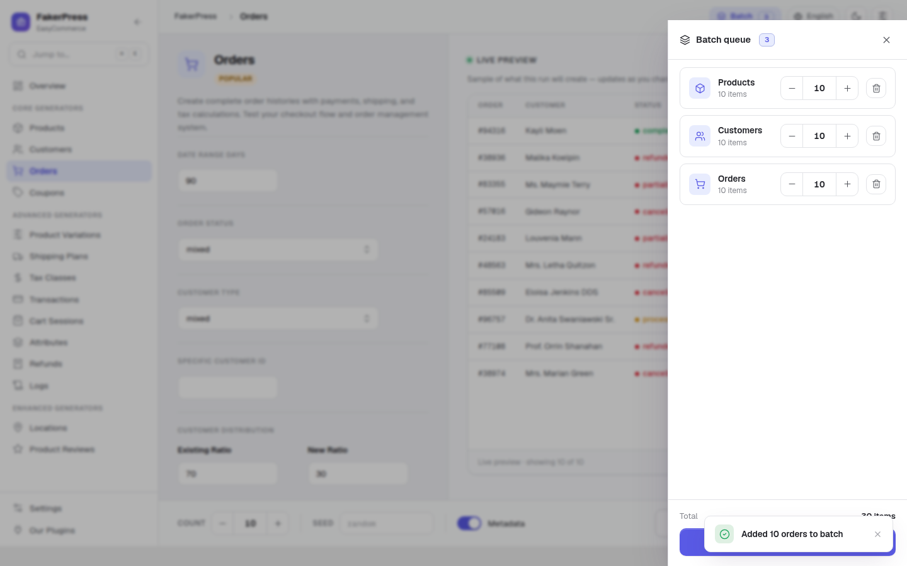

Queue multiple generators and run them sequentially from the batch tray with live progress.

### Tweaks panel

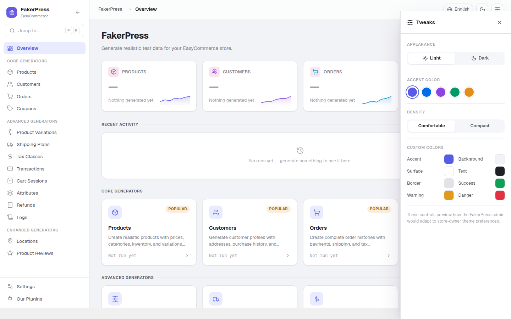

Switch theme (light/dark), accent palette, and density — applied live and persisted.

### Dark mode

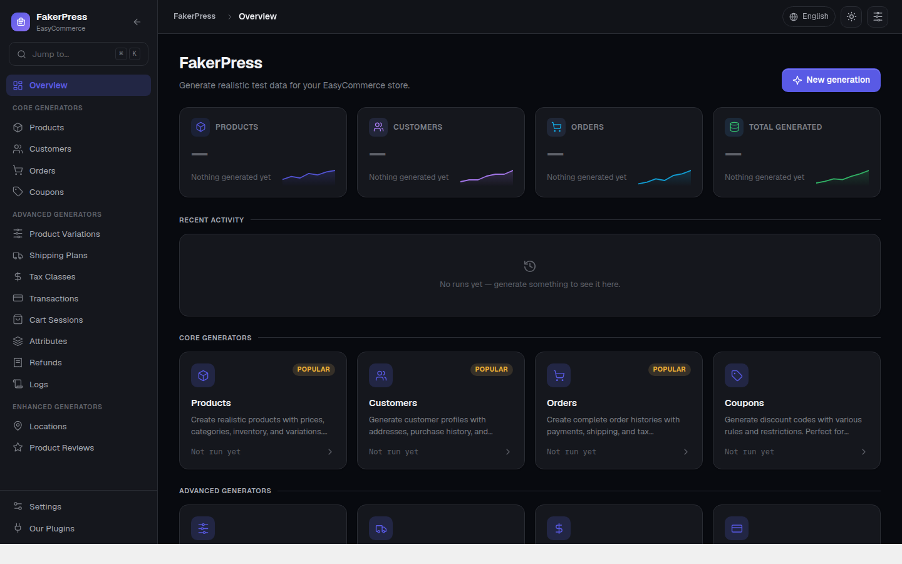

The full admin in dark theme, scoped to the plugin so WordPress chrome stays untouched.

### Settings page

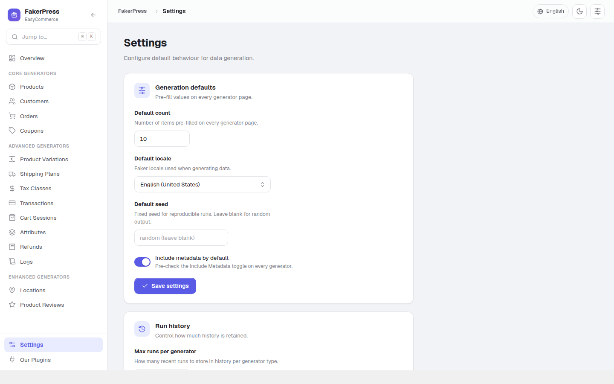

Generation defaults, run-history limit, sample-data sync status, About card, and Danger Zone on the card system.

### Our Plugins page

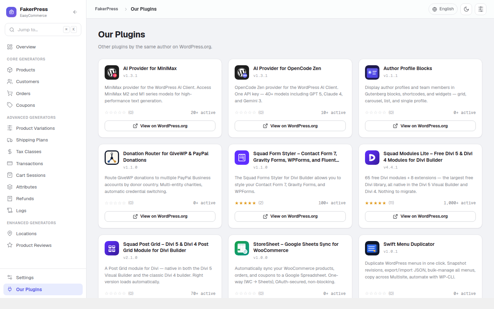

Live WordPress.org plugin cards with ratings, active-install counts, and direct links.

### Product Reviews generator

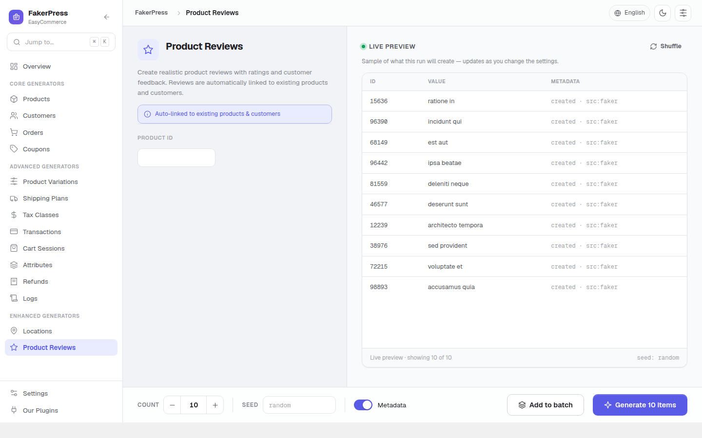

Target a specific product by ID, configure count, locale, seed, and metadata options.

### Locations generator

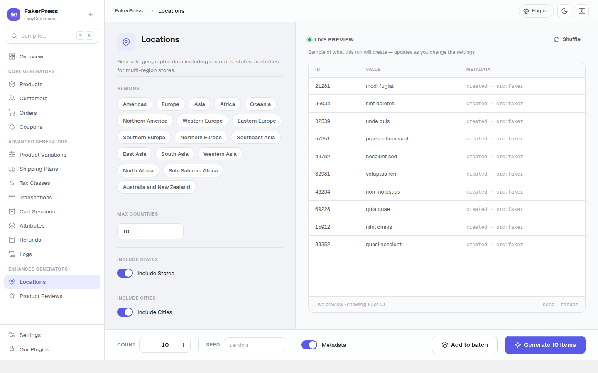

Region chip selects, max countries, state and city generation toggles, cities-per-state range, and coordinate generation.

</details>

## Development

```bash
# JavaScript
yarn start                   # Webpack watch mode
yarn build                   # Production build

# PHP
composer test                # PHPUnit
composer phpcs               # WordPress coding standards lint
composer phpcbf              # Auto-fix coding standards
composer phpstan             # Static analysis (level 8)
composer release             # Lint + analyse + build + makepot + zip

# End-to-end tests
yarn test:e2e:setup          # Configure the WP test environment
yarn test:e2e                # Run all 131 Playwright tests
yarn test:e2e:ui             # Playwright interactive UI
yarn test:e2e:report         # Open the HTML test report
```

## Architecture

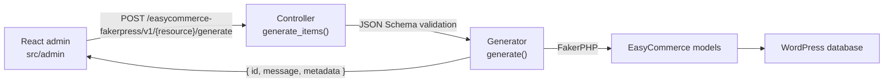
```mermaid
flowchart LR
    A["React admin<br/>src/admin"] -->|"POST /easycommerce-fakerpress/v1/{resource}/generate"| B["Controller<br/>generate_items()"]
    B -->|"JSON Schema validation"| C["Generator<br/>generate()"]
    C -->|FakerPHP| D["EasyCommerce models"]
    D --> E["WordPress database"]
    C -->|"{ id, message, metadata }"| A
```

PHP lives under the PSR-4 namespace `EasyCommerceFakerPress\`:

```
easycommerce-fakerpress.php          Plugin bootstrap
class-easycommerce-fakerpress.php    Singleton orchestrator
includes/
  Abstracts/Generator.php            Base generator (FakerPHP, batch, logging)
  Abstracts/Controller.php           Base REST controller (WP_REST_Controller)
  Generators/                        14 concrete generators
  Controllers/                       14 REST controllers
  MCP/                               MCP server + abilities
```

The admin app is React 18, React Router v7, Radix UI, and Tailwind CSS v4. Entry point `src/index.tsx`, built to `build/app.js`. The compiled bundle is the only JS shipped to WordPress.org; the readable source lives in this repository.

## Extensibility

```php
// Modify generated data before creation
add_filter( 'easycommerce_fakerpress_product_data_before_create', function( $data ) {
    $data['status'] = 'draft';
    return $data;
} );

// Hook after an item is created
add_action( 'easycommerce_fakerpress_after_product_created', function( $product_id, $data ) {
    // custom logic
}, 10, 2 );

// Filter the REST response
add_filter( 'easycommerce_fakerpress_rest_response', function( $response, $request ) {
    return $response;
}, 10, 2 );
```

## External Services

Two outbound requests, both administrator-initiated. Neither sends any site, user, or store data.

| Service | Endpoint | Triggered by | Data sent |
|---------|----------|--------------|-----------|
| GitHub | `github.com/mralaminahamed/easycommerce-fakerpress-sample-data/archive/refs/heads/trunk.zip` | Clicking **Sync Sample Data** in Settings, or a generator needing sample data not yet downloaded | Unauthenticated `GET`; no payload |
| WordPress.org | `api.wordpress.org/plugins/info/1.2/` | Opening the **Our Plugins** page; the request is made by the browser | Author query string only; no payload |

GitHub [terms](https://docs.github.com/en/site-policy/github-terms/github-terms-of-service) and [privacy policy](https://docs.github.com/en/site-policy/privacy-policies/github-general-privacy-statement). WordPress.org [about](https://wordpress.org/about/) and [privacy policy](https://wordpress.org/about/privacy/).

## Security

- All REST endpoints require the `manage_options` capability
- Parameters are validated against JSON Schema before processing
- Generated data is fictional and intended for non-production use only
- Generated data stays in your own database; no analytics, telemetry, or phone-home

Report vulnerabilities privately — see the [security policy](SECURITY.md).

## Changelog

The canonical changelog lives in [`readme.txt`](readme.txt) and is rendered on the [WordPress.org changelog page](https://wordpress.org/plugins/easycommerce-fakerpress/#developers).

## Contributing

Bug reports, feature requests, and pull requests are welcome. Read the [contributing guide](CONTRIBUTING.md) before opening a pull request, and file issues on the [issue tracker](https://github.com/mralaminahamed/easycommerce-fakerpress/issues).

## Maintainer

Al Amin Ahamed — [alaminahamed.com](https://alaminahamed.com) · [@mralaminahamed](https://github.com/mralaminahamed)

## License

[GPL-2.0-or-later](LICENSE)
